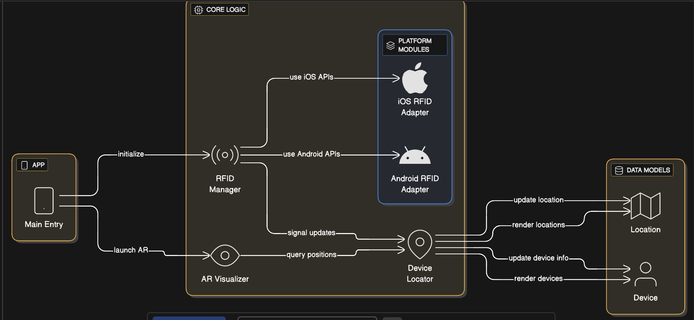

# Pulse


---


## Goal

Pulse helps **rescuers, responders, and civilians detect nearby human presence** in environments where visibility, connectivity, or communication is limited.

In disaster scenarios such as collapsed buildings, smoke-filled structures, power outages, or low-visibility search areas, people often carry smartphones even when they cannot actively signal for help. These phones continue emitting short-range radio signals.

Pulse passively observes these ambient signals and infers **probable nearby device presence** based on consistent behavior over time. This enables responders to identify likely survivor locations, distinguish stationary presence from transient movement, and operate **fully offline**, without infrastructure or identity data.

Pulse does **not** identify individuals. It detects **presence**.

---

## Overview

Modern smartphones continuously emit short-range radio signals even when locked.

Pulse evaluates these signals over time and focuses on **behavior**, not single events:

* **Persistence** — does a signal remain over time?
* **Stability** — does it decay naturally or fluctuate?
* **Clustering** — do multiple signals correlate spatially or temporally?
* **Motion behavior** — stationary vs transient sources

A single ping is meaningless.
**Consistent behavior over time is not.**

Pulse is a **phone-only**, **offline**, **privacy-preserving** mobile app built with **Kotlin Multiplatform** for Android and iOS.

---

## How to Run the App

### Prerequisites

* macOS
* Android Studio (Giraffe or newer)
* Xcode 15+ (for iOS)
* Physical Android phone or iPhone
* USB cable

No accounts, servers, or API keys are required.

---

### Run on Android (Recommended)

1. **Clone the repository**

   ```bash
   git clone https://github.com/VedPanse/Pulse.git
   cd Pulse
   ```

2. **Open in Android Studio**

   * Open the project root
   * Select the **Android app module** (`app` / `androidApp`)
   * Wait for Gradle sync to complete

3. **Enable USB debugging on the phone**

   * Settings → About phone → tap *Build number* 7×
   * Settings → Developer options → **USB debugging ON**

4. **Connect and run**

   * Unlock the phone and approve the debugging prompt
   * Select the physical device in the toolbar
   * Click ▶ **Run**

The app installs and launches directly on the phone.

---

### Run on iOS

1. Open `iosApp` in **Xcode**
2. Select a connected iPhone
3. Set signing with a free Apple ID
4. Click ▶ **Run**

---

## What Happens on Launch

* Passively listens for ambient Bluetooth Low Energy signals
* Scores persistence, variance, and motion over time
* Visualizes **probable nearby device presence**
* Operates fully **offline**

No data is stored or transmitted.


---

## System Architecture



Pulse is built using **Kotlin Multiplatform** with a strict separation of concerns.

### Shared Core (`commonMain`)

All detection logic lives in shared Kotlin code:

* Signal normalization
* Rolling time windows
* Presence confidence scoring
* Temporal decay modeling
* Motion classification
* Spatial and temporal clustering

This code is compiled **unchanged** for both Android and iOS.

### Platform Layers

* **Android**: Bluetooth LE scanning and permissions
* **iOS**: CoreBluetooth scanning (within OS constraints)

Platform code is limited to signal ingestion only.

---

## Offline & Privacy Guarantees

Pulse enforces hard constraints by design:

* No internet access
* No servers or analytics
* No device identifiers
* No MAC address storage
* No persistent data across restarts

All signal data is ephemeral and cleared on app restart.

Pulse detects **presence**, not **people**.

---

## Project Structure

```
Pulse/
├── shared/      # Kotlin Multiplatform detection logic
├── androidApp/  # Android application wrapper
├── iosApp/      # iOS application wrapper
```

---

## License

This project is licensed under the [Apache License](LICENSE).
